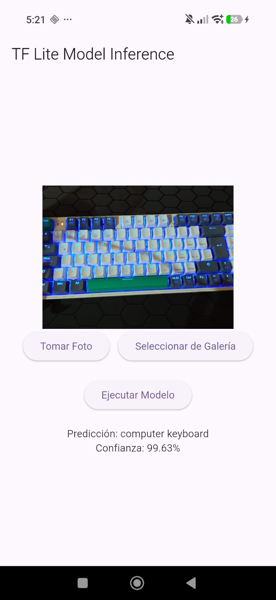
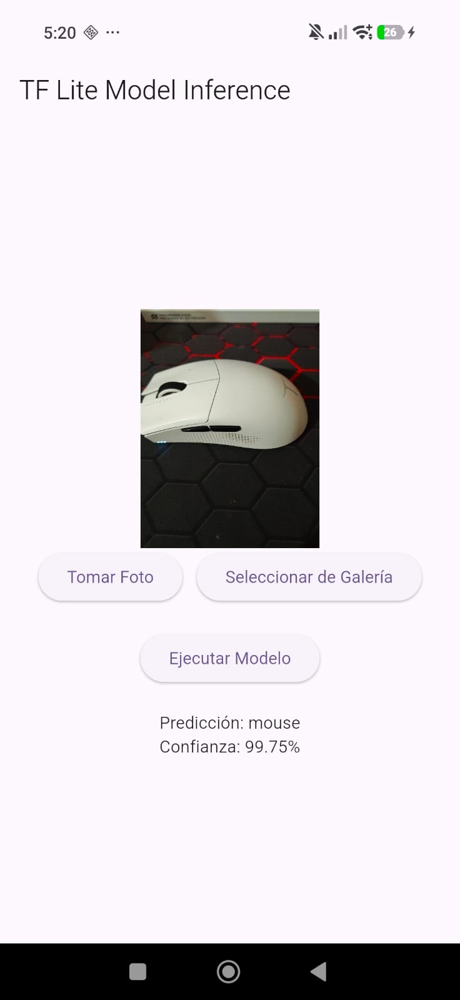
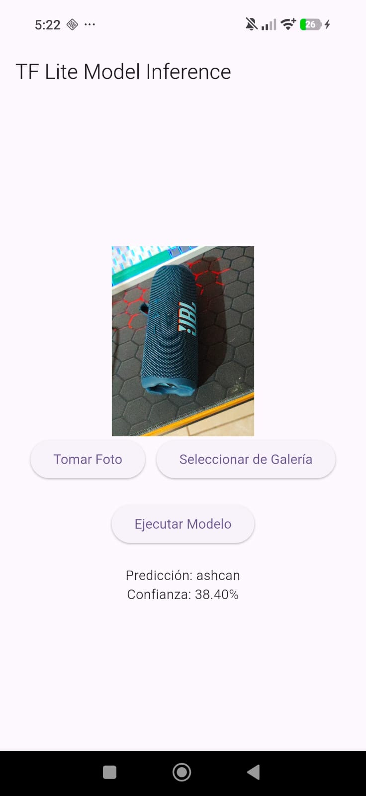

# tflite

Modelo descargable de: 

https://github.com/emgucv/models/tree/master/mobilenet_v1_1.0_224_float_2017_11_08

## Cambios recientes

- Se añadió la opción para obtener imágenes desde la cámara del dispositivo o desde la galería.
- Botones en la UI: `Tomar Foto` (usa la cámara) y `Seleccionar de Galería` (usa `ImagePicker`).
- Se añadió el permiso de cámara en `android/app/src/main/AndroidManifest.xml` y se actualizó la lógica en `lib/main.dart`.

## Capturas de ejemplo

-  — Imagen 1: captura de la app clasificando una imagen de un teclado.
-  — Imagen 2: captura de la app clasificando una imagen de un mouse.
-  — Imagen 3: captura de la app clasificando una imagen de una bocina.

